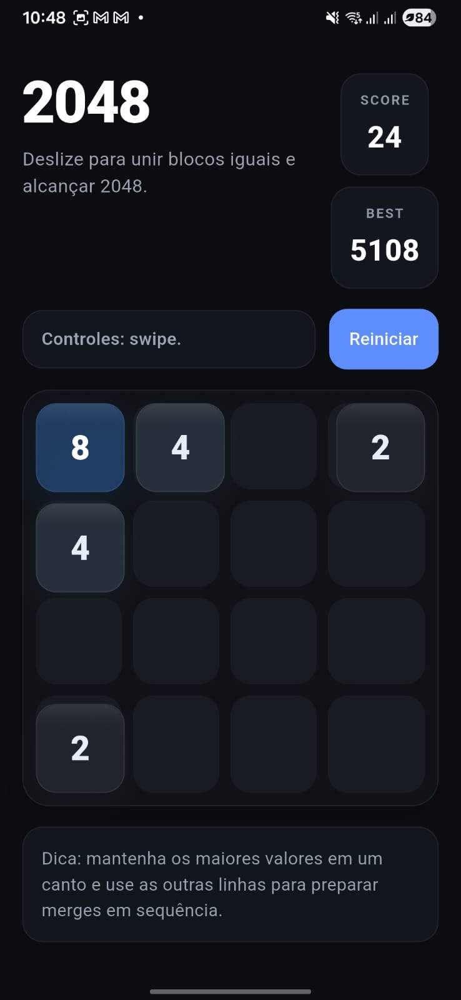

# Jogo 2048 (Flutter)

Implementacao do jogo 2048 em Flutter com tema dark, animacoes suaves, suporte a teclado e gestos, haptics e persistencia de recorde local.

## Demo

<p align="center">
	
</p>

## Sumario

- [Visao geral](#visao-geral)
- [Recursos](#recursos)
- [Tecnologias e dependencias](#tecnologias-e-dependencias)
- [Requisitos](#requisitos)
- [Como executar](#como-executar)
- [Controles](#controles)
- [Regras do jogo](#regras-do-jogo)
- [Estrutura do projeto](#estrutura-do-projeto)
- [Persistencia de dados](#persistencia-de-dados)
- [Personalizacao rapida](#personalizacao-rapida)
- [Build para producao](#build-para-producao)

## Visao geral

Este projeto entrega uma experiencia moderna do 2048 com foco em:

- Interface dark com visual limpo e legivel.
- Animacoes de movimento, merge e spawn de blocos.
- Feedback tatil (haptic) em eventos importantes.
- Overlay de vitoria ao alcancar 2048 e estado de fim de jogo.
- Melhor pontuacao salva localmente.

## Recursos

- Tabuleiro 4x4 com logica completa de merge por direcao.
- Geração aleatoria de novo bloco apos jogada valida:
	- 90% de chance de gerar `2`.
	- 10% de chance de gerar `4`.
- Contador de `SCORE` e `BEST` com atualizacao animada.
- Reinicio rapido da partida pelo botao de interface.
- Mensagens e overlays para:
	- vitoria (quando um bloco `2048` e formado);
	- derrota (quando nao ha movimentos disponiveis).

## Tecnologias e dependencias

- Flutter (Material 3)
- Dart SDK `^3.9.0`
- [shared_preferences](https://pub.dev/packages/shared_preferences) para persistir recorde
- [flutter_launcher_icons](https://pub.dev/packages/flutter_launcher_icons) para geracao de icones
- [flutter_lints](https://pub.dev/packages/flutter_lints) para padroes de analise

## Requisitos

- Flutter SDK instalado e configurado no PATH.
- Um dispositivo/emulador ativo (Android, iOS, Web, Windows, Linux ou macOS).
- Dependencias do Flutter instaladas corretamente:

```bash
flutter doctor
```

## Como executar

1. Clone o repositorio:

```bash
git clone https://github.com/vinicius-pascoal/2048_game.git
```

2. Acesse a pasta do projeto:

```bash
cd 2048_game
```

3. Instale as dependencias:

```bash
flutter pub get
```

4. Rode o app:

```bash
flutter run
```

## Controles

- Mobile:
	- deslize (swipe) para cima, baixo, esquerda ou direita.
- Teclado:
	- setas direcionais (`←`, `→`, `↑`, `↓`);
	- ou `W`, `A`, `S`, `D`;
	- `R` para reiniciar a partida.

## Regras do jogo

- Ao mover, todos os blocos deslizam na direcao escolhida.
- Blocos com mesmo valor, quando colidem no movimento, se fundem.
- Cada merge soma pontos ao `SCORE`.
- O objetivo principal e formar o bloco `2048`.
- Depois de alcancar `2048`, e possivel continuar jogando.
- O jogo termina quando nao existem casas vazias e nenhum merge possivel.

## Estrutura do projeto

Principais pastas e arquivos:

- `lib/main.dart`: interface, logica do jogo, animacoes e entrada do usuario.
- `pubspec.yaml`: metadados do app, dependencias e assets.
- `assets/icon/icon.png`: icone do aplicativo.
- `demo.jpg`: imagem de demonstracao usada neste README.
- `analysis_options.yaml`: regras de lint/analise estaticas.

## Persistencia de dados

O melhor score (`BEST`) e salvo localmente com `shared_preferences` usando a chave:

- `best_score_2048_dark`

Isso permite manter o recorde entre sessoes do app no mesmo dispositivo.

## Personalizacao rapida

### Alterar icone do app

Substitua o arquivo abaixo:

- `assets/icon/icon.png`

Depois gere novamente os icones:

```bash
dart run flutter_launcher_icons
```

### Ajustar cores/tipografia do jogo

As principais configuracoes de tema e estilo estao em:

- `MyApp` (tema global)
- metodos `_tileColor`, `_textColor` e `_fontSize` em `lib/main.dart`

## Build para producao

### Android (APK)

```bash
flutter build apk --release
```

### Android (App Bundle)

```bash
flutter build appbundle --release
```

### Web

```bash
flutter build web --release
```
